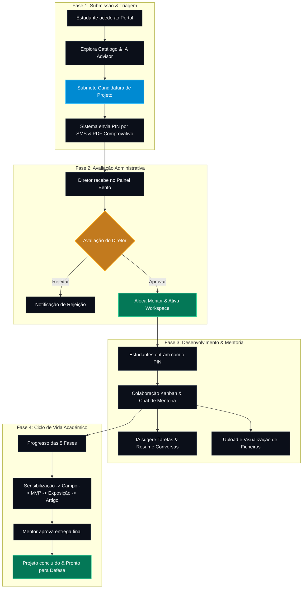

# 🗺️ Proposta e Fluxo de Funcionamento: UniLicungo TechHub
**Uma plataforma inteligente e integrada para gestão de projetos académicos, mentoria e desenvolvimento de soluções SaaS na Universidade Licungo.**

---

## 1. O Problema vs. A Solução

*   **O Problema (Como era antes):**
    *   Candidaturas de projetos e trabalhos de fim de curso geridos via e-mail ou fichas físicas, propensas a perdas e atrasos.
    *   Dificuldade em acompanhar o progresso real dos grupos (se estão na fase de campo, MVP ou escrita do artigo).
    *   Mentoria e comunicação descentralizadas (WhatsApp pessoal, sem histórico oficial para a coordenação).
    *   Ausência de um catálogo público centralizado que mostre o que a faculdade está a produzir.

*   **O Solução (UniLicungo TechHub):**
    *   Um ecossistema digital **Mobile-First** e **PWA-ready** com suporte a temas Claro e Escuro.
    *   Catálogo interativo de projetos integrado com Inteligência Artificial para guiar os estudantes.
    *   **Workspace único por grupo** com Kanban, Chat em tempo real e repositório de ficheiros.
    *   Painel administrativo unificado para Diretores de Curso e Docentes acompanharem métricas e alocarem mentores de forma rápida.

---

## 2. Personas do Sistema

1.  **Estudante (Líder & Membros):** Pesquisa projetos, candidata-se, recebe notificações, interage no chat do grupo e atualiza o progresso das tarefas no Kanban.
2.  **Docente (Mentor):** Acompanha o desenvolvimento, conversa no chat, avalia entregáveis (artigo, MVP, campo) e valida a evolução das fases.
3.  **Administrador / Diretor de Curso:** Aprova/rejeita submissões, aloca mentores, gere acessos e visualiza estatísticas de desempenho global.

---

## 3. Fluxo de Trabalho (Workflow) Ponta a Ponta

---

## 4. Detalhes das Fases para Explicação Executiva

### Fase 1: Portal Público & Candidatura
*   **Catálogo de Ideias:** O estudante visualiza problemas/projetos estruturados por áreas de conhecimento (Educação, Gestão, Tecnologia).
*   **Orientador de IA (AI Advisor):** Um assistente integrado que responde a dúvidas do estudante sobre como abordar o projeto, sugere arquiteturas e tecnologias.
*   **Submissão Inteligente:** O grupo introduz os nomes, números mecanográficos e contactos. O sistema valida os limites de ocupação do projeto.
*   **Comunicação Imediata:** Assim que a submissão é concluída:
    1. O grupo recebe no telemóvel um **SMS automático** contendo o PIN único de acesso ao seu futuro Workspace.
    2. É gerada a Ficha de Registo em PDF pronta a imprimir.
    3. Opção rápida para partilhar os dados do grupo e o comprovativo diretamente no **WhatsApp**.

### Fase 2: Gestão de Candidaturas (Painel Admin/Docente)
*   **Dashboard Bento Grid:** Apresentação limpa de métricas críticas (Total de candidaturas, Aprovadas, Rejeitadas, Pendentes).
*   **Filtros Inteligentes:** Pesquisa em tempo real e separação por estado ("Pendente", "Aprovado") de forma instantânea.
*   **Alocação Rápida:** O diretor escolhe um mentor da lista de docentes num menu suspenso auto-guardável.
*   **Triagem:** Com um clique, o projeto é aprovado, ativando instantaneamente a sala de workspace do grupo.

### Fase 3: Workspace e Mentoria Ativa
*   **Acesso Seguro:** Estudantes entram usando o PIN de grupo (com fluxo robusto de recuperação de PIN via e-mail e SMS em caso de perda).
*   **Chat Colaborativo:** Canal direto entre estudantes e o mentor com persistência de mensagens.
*   **Apoio da IA no Workspace:**
    *   **Sugestão de Kanban:** A IA lê o tema do projeto e cria de forma automática uma lista de tarefas recomendadas no quadro Kanban.
    *   **Resumos Executivos:** O mentor pode solicitar à IA um resumo das discussões do chat para saber rapidamente o progresso do grupo sem ler centenas de mensagens.
*   **Repositório de Ficheiros:** Upload de documentos com pré-visualização elegante (imagens, vídeos, PDFs e código-fonte) em modais flutuantes responsivos, eliminando a necessidade de transferir ficheiros desnecessários para o disco.

### Fase 4: O Funil de Progresso Académico
*   Os projetos não são apenas código ou tarefas soltas. Eles seguem a metodologia oficial dividida em 5 sub-fases:
    1.  **Sensibilização:** Definição do problema e preparação inicial.
    2.  **Campo:** Coleta de dados reais.
    3.  **MVP (Minimum Viable Product):** Construção da primeira versão funcional da solução.
    4.  **Exposição:** Demonstração do protótipo à comunidade.
    5.  **Artigo:** Escrita e formatação científica do trabalho final.
*   O mentor pode alterar o estado das fases, garantindo que a faculdade tenha um mapa térmico de onde cada grupo se encontra.

---

## 5. Proposta de Valor para o Diretor / Universidade

*   **Controlo e Transparência:** Estatísticas em tempo real sobre quantos projetos estão ativos, quantos estudantes estão envolvidos e o ritmo de entrega.
*   **Histórico Consolidado:** Tudo fica registado na plataforma (conversas, ficheiros partilhados, relatórios da IA). Em caso de mudança de mentor, o histórico do grupo permanece intacto.
*   **Inovação Institucional:** O uso de IA generativa para auxiliar os estudantes no planeamento (Kanban) e resumir discussões coloca a Universidade Licungo na vanguarda tecnológica.
*   **Eficiência de Tempo:** Reduz o tempo de triagem administrativa de semanas para apenas alguns minutos.
